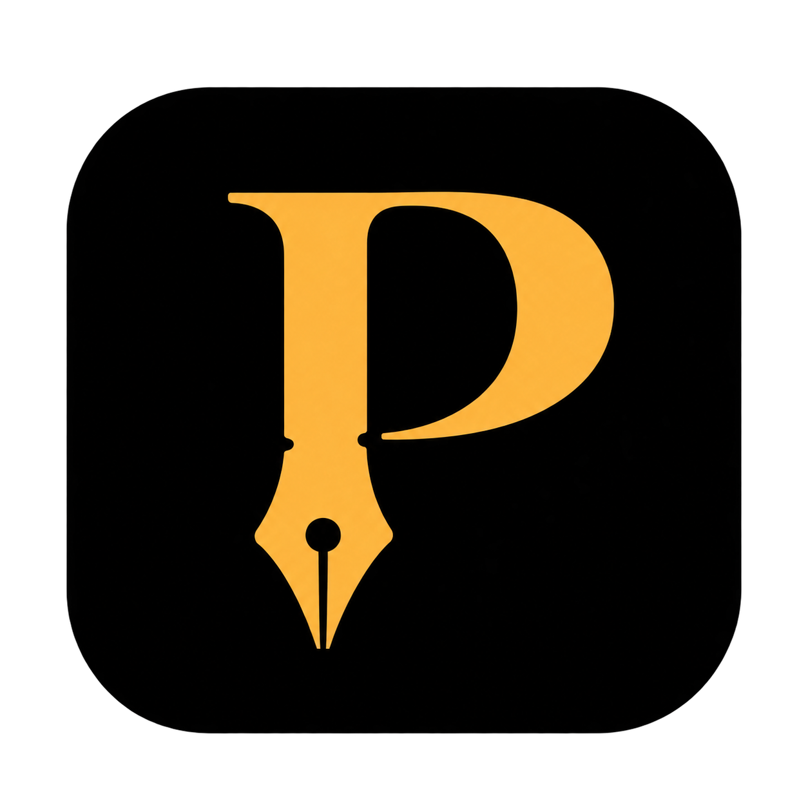

# Perkins WritingSpace 圖示

## 定稿與用途

`perkins-icon-black-gold.png` 是作者於 2026-09-30 選定的 Perkins WritingSpace 圖示設計原稿，供應用程式圖示與品牌識別使用。

## 設計概念

- 英文字母 **P** 代表 Perkins；直幹延伸成鋼筆尖，將字母與寫作工具結合。
- 襯線字形傳達文學與出版氣質；黑色背景搭配金色圖形，形成品牌主識別。
- 鋼筆呼應產品理念：作者握筆、掌握稿件控制權，AI 只提出建議。

## 使用位置

- 桌面捷徑、工作列與應用程式視窗圖示。
- 啟動頁、關於頁與產品介紹中的品牌標記。
- 文件與宣傳素材中的圖示識別。

## 檔案狀態與後續製作

此檔為 ImageGen 產生、經作者選定的 PNG 點陣原稿，已於 2026-10-05 套用至應用程式。產出的檔案：

- `app/build/appicon.png`：1024×1024，保留透明，供 Wails 應用程式圖示使用。
- `app/build/windows/icon.ico`：Windows 圖示，內含 16、24、32、48、64、128、256 各尺寸（由 Python Pillow 產生，非單一尺寸縮放）。
- `app/frontend/src/assets/images/perkins-logo.svg`：側欄圖示列與標題欄用的向量版 logo（約 9 KB）。由原稿描圖產生：金色遮罩（顏色門檻）以 vtracer 0.6.15 描邊（`colormode=binary`、`mode=spline`、`filter_speckle=8`、`path_precision=2`）得到 P 的路徑；黑底圓角方塊不用描圖，依原稿 alpha 遮罩量測為 `x=103 y=135 w=1048 h=1002 rx=219.5`（viewBox 1254×1254）直接畫 rect；顏色只有兩個：`#000000` 與金色 `#FDB53D`（原稿 P 字核心色）。與原稿全尺寸逐像素比對，金色區域差異 0.18%、透明度差異 0.13%（皆為邊缘反鋸齒）。
- 原本的 `app/frontend/src/assets/images/perkins-logo.png`（128×128 點陣縮圖）已被 SVG 取代並刪除。

16 像素版本因原稿的筆尖細節過細，縮圖後筆尖會糊成一小塊（24 像素以上可辨）；未改造型，維持原稿。exe 圖示仍用點陣原稿。需要印刷或大幅縮放用途時，應以這份 SVG 為基礎重做向量原稿（目前的路徑是描圖結果，節點已簡化，不是原始設計檔）。

衍生版本應保留 P 與鋼筆尖結合的造型，以及黑底金色的主識別。修改品牌造型或主配色前，須由作者決定。
